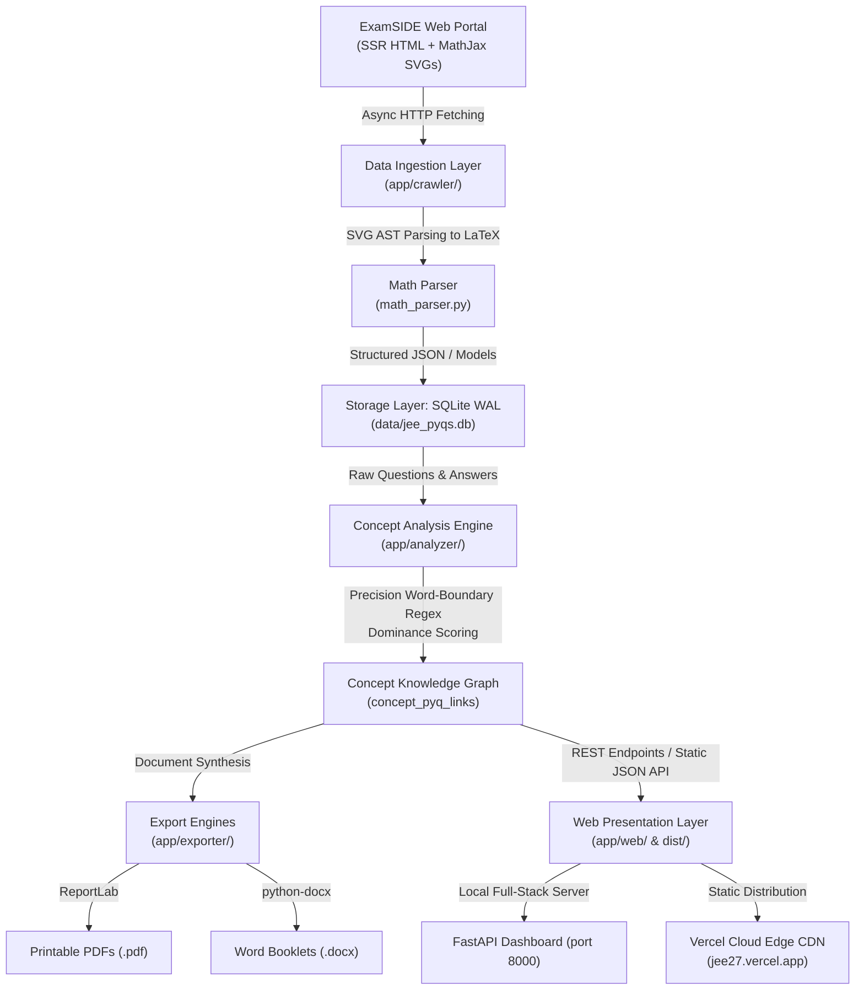

# Project Details: JEE & KCET PYQ Intelligence & Concept Revision Engine

---

## 1. Executive Summary

The **JEE & KCET PYQ Intelligence & Concept Revision Engine** is an end-to-end, autonomous educational data intelligence platform built for engineering entrance exam aspirants (specifically **JEE Main** and **KCET Karnataka CET**).

Rather than presenting students with uncurated, thousands-long dumps of Previous Year Questions (PYQs), this system crawls, decodes, analyzes, and synthesizes 15,000+ past exam questions into a **concept-first knowledge graph**. Every single question is parsed from raw server-side rendered HTML, decoded from SVG math formulas into LaTeX, classified into empirical sub-chapter concepts, and linked bidirectionally to actionable formula sheets, recurring traps, speed tricks, and print-ready revision booklets.

The project is deployed and live for production use at:
- **Production URL**: [https://jee27.vercel.app/](https://jee27.vercel.app/)
- **Development/Staging URL**: [https://jee27-dev.vercel.app/](https://jee27-dev.vercel.app/)
- **GitHub Repository**: [https://github.com/advitxsingh/jee-pyqs](https://github.com/advitxsingh/jee-pyqs) (Branches: `master`, `dev`)

---

## 2. Core Problem & Mission

### The Problem
- **Unstructured Question Dumps**: Websites like ExamSIDE provide extensive archives of questions, but they are flat lists. Students cannot easily identify which subtopic a question tests (e.g., in Electrochemistry: Daniell Cell vs. Nernst Equation vs. Kohlrausch's Law vs. Commercial Batteries).
- **Math Jax SVG Obfuscation**: Most competitive exam portals render formulas as complex Server-Side Rendered (SSR) MathJax SVG glyphs (`<use data-c="0x1D465">`, `<g data-mml-node="msup">`). These are impossible to copy, search, or convert to clean digital study notes without an AST decoder.
- **Cross-Topic Ambiguity**: Simple keyword searches cause massive false positives (e.g., searching "RMS" matches "in terms of"; searching "anode" on battery questions matches ordinary galvanic cells).
- **Lack of Print-Ready Study Material**: Students often need distraction-free physical or tablet study notes with priority matrices, formula cheatsheets, common pitfalls, and benchmark solved questions.

### The Mission
1. **Autonomous Data Extraction**: Crawl and parse 100% of ExamSIDE chapters for JEE Main and KCET across Physics, Chemistry, and Mathematics.
2. **Lossless Math Reconstruction**: Decode SVG MathML nodes into standardized LaTeX expressions (`$E = E^\circ - \frac{0.0591}{n}\log Q$`).
3. **Precision Concept Segregation**: Match questions to granular concepts using word-boundary regular expressions and strict dominance scoring, eliminating cross-topic leakage.
4. **Automated Revision Booklets**: Generate publication-quality Microsoft Word (`.docx`) and ReportLab (`.pdf`) documents for every chapter with dynamic pagination ("Page X of Y"), formula tables, trap alerts, and benchmark questions.
5. **Ultra-Fast, Distraction-Free UI**: Provide a high-performance web dashboard inspired by the minimalist design philosophy of Linear, Raycast, and Vercel.

---

## 3. Key Dataset Metrics & Scale

| Metric | Quantity | Details |
| :--- | :---: | :--- |
| **Total Questions Indexed** | **15,683** | Complete question statement, options (A–D), correct answer key, and detailed explanation |
| **Total Chapters Covered** | **186** | 91 JEE Main chapters + 95 KCET chapters |
| **Total Synthesized Concepts** | **468** | Granular formula archetypes, theory concepts, and topic groupings |
| **Bidirectional Concept-PYQ Links** | **16,228** | Explicit mappings connecting each question to its primary and secondary concepts |
| **Generated Word Booklets (`.docx`)** | **186** | Complete with formatted tables, callouts, benchmark questions, and answers |
| **Generated PDF Booklets (`.pdf`)** | **186** | Formatted via ReportLab with running headers, footers, and page numbers |
| **Total Export Documents** | **372** | Over 160 MB of high-yield printable study assets |
| **Exams Supported** | **2** | JEE Main (National) and KCET (Karnataka State) |
| **Subjects Supported** | **3** | Physics, Chemistry, Mathematics |

### Exam Breakdown
- **JEE Main**: 91 Chapters, ~13,900 questions indexed. Full multi-shift coverage (January and April sessions from 2019 through 2026+).
- **KCET**: 95 Chapters, ~1,800 questions indexed. Complete yearly past paper coverage (2004 through 2024).

---

## 4. Architectural Overview

The system is designed with a modular 5-tier architecture:



---

## 5. Detailed Component Breakdown

### 5.1 Data Ingestion & MathJax SVG AST Decoder (`app/crawler/`)
- [`app/crawler/math_parser.py`](file:///X:/code/jee-pyqs/app/crawler/math_parser.py):
  - ExamSIDE embeds formulas inside MathJax SVG trees. Each glyph references a Unicode character using hex code in `data-c` (e.g., `data-c="1D465"` represents math italic $x$, `data-c="32"` represents number $2$, `data-c="2212"` represents minus sign).
  - Reconstructs higher-level MathML abstract syntax trees:
    - `<g data-mml-node="msup">`: Base + Superscript (`x^{2}`).
    - `<g data-mml-node="msub">`: Base + Subscript (`a_{n}`).
    - `<g data-mml-node="msubsup">`: Base + Subscript + Superscript.
    - `<g data-mml-node="mfrac">`: Numerator + Denominator (`\frac{num}{den}`).
    - `<g data-mml-node="msqrt">`: Radical content (`\sqrt{...}`).
    - `<g data-mml-node="mover">`: Vector accents (`\vec{v}` or `\overline{...}`).
    - `<g data-mml-node="mtable">`: Matrices and determinant arrays.
  - Normalizes non-standard Unicode artifacts (e.g., non-breaking spaces `\xa0`, mathematical bold/italic characters) into standard ASCII and clean LaTeX syntax (`$...$`).
- [`app/crawler/page_parser.py`](file:///X:/code/jee-pyqs/app/crawler/page_parser.py):
  - Parses chapter landing pages, extracting pagination URLs, question counts, and subject metadata.
  - Parses question elements (`.card-question`):
    - Question ID (`qid`) and Paper Name (`paper_name`, e.g., `"JEE Main 2024 (01 Feb Shift 1)"`).
    - Question type (`MCQ` with options A–D, or `NUM` numerical integer).
    - Marking scheme, correct answer key, and full question body.
    - Post-submission explanation `.when-answered.q-result` containing full step-by-step derivations and image URLs.
- [`app/crawler/crawler.py`](file:///X:/code/jee-pyqs/app/crawler/crawler.py):
  - High-throughput asynchronous crawler using `httpx.AsyncClient` with connection pooling.
  - Batch striding: Fetches multiple question URLs concurrently with rate limiting and exponential backoff to respect target server limits.

### 5.2 Storage Layer (`app/db/`)
- [`app/db/database.py`](file:///X:/code/jee-pyqs/app/db/database.py) & [`app/db/models.py`](file:///X:/code/jee-pyqs/app/db/models.py):
  - SQLite database (`data/jee_pyqs.db`) configured with Write-Ahead Logging (`WAL` mode) and `NORMAL` synchronous mode for high-concurrency read/write operations without table locking.
  - Relational Schema:
    - `chapters`: Stores chapter metadata, exam type (`jee-main` or `kcet`), subject, URLs, question counts, crawl status.
    - `questions`: Stores 15,683 questions with full text, LaTeX formulas, options JSON, answer key, solution explanation, year, shift, exam, and difficulty rating.
    - `concepts`: Stores 468 synthesized concepts with summaries, standard formulas, common traps, speed tips, and empirical exam frequency tiers.
    - `concept_pyq_links`: Foreign-key junction table mapping `(concept_id, question_id)` with contextual notes.

### 5.3 Analytical Engine & Precision Concept Extractor (`app/analyzer/`)
- [`app/analyzer/concept_extractor.py`](file:///X:/code/jee-pyqs/app/analyzer/concept_extractor.py):
  - **Curated Taxonomy Matrix**: Detailed taxonomies covering 186 chapters. Each concept defines `primary` keywords, `formula_cues`, `secondary` contextual keywords, summary text, standard formulas, and common traps.
  - **Word Boundary Regex Matching**: All textual keywords are evaluated using `\b` word boundaries (e.g., `\brms\b` will not match `"in terms of"`; `\brust\b` will not match `"thrust"`).
  - **Strict Dominance Selection**:
    - Calculates a weighted score for each concept: formula cues (+6 pts), primary keywords (+5 pts), co-occurring secondary pairs (+2 pts).
    - The concept with the highest score is the primary concept.
    - Secondary concepts are only added if their score is $\ge 75\%$ of the maximum score **and** $\ge 8$ points.
  - **Semantic Token Overlap Fallback**:
    - For questions with zero explicit keyword hits, eliminates random assignment by running a set-intersection overlap between the question's normalized tokens and the concept's title, summary, and formulas.
- [`app/analyzer/chapter_synthesizer.py`](file:///X:/code/jee-pyqs/app/analyzer/chapter_synthesizer.py):
  - Synthesizes dynamic Markdown chapter notes.
  - Computes empirical question frequency per concept.
  - Generates frequency tiers (`Very High`: $\ge 25\%$ of chapter PYQs; `High`: $\ge 12\%$; `Moderate`: remaining).
  - Identifies recurring traps (sign conventions, SI unit oversights, boundary cases).

### 5.4 Document Exporters (`app/exporter/`)
- [`app/exporter/docx_exporter.py`](file:///X:/code/jee-pyqs/app/exporter/docx_exporter.py):
  - Produces formatted `.docx` Word revision notes.
  - Uses professional typography: Aptos / Calibri body font, Cambria Math styling, shaded header rows, and color-coded caution callouts for traps.
  - Embeds Priority Matrix tables, full formula reference sheets, and representative benchmark PYQs with solutions.
- [`app/exporter/pdf_exporter.py`](file:///X:/code/jee-pyqs/app/exporter/pdf_exporter.py):
  - Built with ReportLab using a custom `NumberedCanvas` that calculates total pages dynamically to render "Page X of Y" in the footer.
  - High-contrast STEM styling: slate-blue primary accents, shaded table borders, rounded callout panels for exam traps, and clean question cards.

### 5.5 Presentation & Web Layer (`app/web/` & `dist/`)
- [`app/web/app.py`](file:///X:/code/jee-pyqs/app/web/app.py):
  - FastAPI backend serving REST endpoints (`/api/chapters`, `/api/chapter/{slug}`, `/api/chapter/{slug}/questions`, `/api/chapter/{slug}/concepts`, `/api/export/{slug}/docx`, `/api/export/{slug}/pdf`).
- [`app/web/templates/index.html`](file:///X:/code/jee-pyqs/app/web/templates/index.html):
  - Single-Page Application (SPA) designed with a minimalist technical aesthetic (Linear / Raycast / Vercel style).
  - Pure dark neutrals (`#09090b` canvas, `bg-zinc-900/60` cards, `border-zinc-800`).
  - Strict 1-accent rule for active states; zero emojis; 14–16px clean monochrome SVG icons.
  - **macOS Spotlight Finder (`Cmd+K` / `Ctrl+K`)**: Instant keyboard-driven fuzzy search across all 186 chapters.
  - **Active Topic Filter Banner**: When a topic is selected, an active indicator banner displays `Filtered Topic: {name}` with a 1-click `[Show All Questions ×]` button.
  - **Interactive Topic Chips**: Question cards display clickable topic chips for instant contextual filtering.
  - **KaTeX Integration**: Real-time client-side rendering of complex LaTeX formulas.
  - **Dual Mode (Backend / Static)**: Automatically switches to local REST API when running on localhost, or uses pre-built static JSON files when hosted on Vercel.

---

## 6. Directory Structure

```
jee-pyqs/
├── app/
│   ├── analyzer/
│   │   ├── analyzer_service.py       # Pipeline orchestrator: extraction, linking & exports
│   │   ├── chapter_synthesizer.py   # Generates chapter summaries, notes & frequency tiers
│   │   └── concept_extractor.py     # 186-chapter taxonomy, regex matcher & dominance filter
│   ├── crawler/
│   │   ├── crawler.py               # Async HTTP batch crawler with rate limiting
│   │   ├── math_parser.py           # MathJax SVG AST to LaTeX decoder
│   │   └── page_parser.py           # ExamSIDE HTML question/chapter scraper
│   ├── db/
│   │   ├── database.py              # SQLite database manager, queries & indexes
│   │   └── models.py                # Pydantic data schemas
│   ├── exporter/
│   │   ├── docx_exporter.py         # Word (.docx) revision booklet generator
│   │   └── pdf_exporter.py          # ReportLab PDF (.pdf) generator with NumberedCanvas
│   └── web/
│       ├── app.py                   # FastAPI REST API application
│       └── templates/
│           └── index.html           # Minimalist Linear/Vercel SPA dashboard
├── data/
│   ├── jee_pyqs.db                  # Primary SQLite database (74+ MB, 15,683 questions)
│   └── exports/                     # Generated 372 revision booklets (.docx and .pdf)
├── dist/                            # Production static deployment bundle
│   ├── data/api/                    # Pre-rendered static JSON API for all 186 chapters
│   ├── exports/                     # Downloadable static copies of DOCX & PDF booklets
│   ├── index.html                   # Bundled standalone web client
│   └── vercel.json                  # Vercel SPA routing & cache-control configuration
├── scripts/
│   ├── clean_db_titles.py           # Strips redundant syllabus tags from chapter titles
│   ├── crawl_all_syllabus.py        # Comprehensive background crawler for 186 chapters
│   ├── fix_taxonomy_strings.py      # Cleans escape characters in taxonomy metadata
│   ├── reanalyze_all_concepts.py    # Re-runs concept extraction across all 15,683 questions
│   ├── retry_pending.py             # Diagnostic and retry script for failed fetches
│   ├── status_check.py              # Reports database question & concept counts
│   └── test_kcet_crawl.py           # Integration test script for KCET portal
├── tests/
│   ├── test_analyzer.py             # Concept extraction & dominance scoring unit tests
│   ├── test_api.py                  # FastAPI REST API integration tests
│   ├── test_crawler.py              # Async crawler tests
│   ├── test_database.py             # SQLite CRUD and link relation tests
│   ├── test_exporters.py            # DOCX and PDF file generation integrity tests
│   ├── test_math_parser.py          # MathJax SVG AST decoding & Unicode symbol tests
│   └── test_page_parser.py          # HTML scraping & explanation parser tests
├── crawl_pilot.py                   # CLI runner for pilot chapters
├── export_static.py                 # Static export compiler (generates dist/)
├── ProjectDetails.md                # This comprehensive project documentation
├── README.md                        # Quickstart documentation
├── run.py                           # Local dashboard server launcher
└── vercel.json                      # Vercel deployment configuration
```

---

## 7. How to Run & Operate

### 7.1 Prerequisites
- Python 3.10+ (tested with Python 3.12 and 3.13 on Windows/Linux/macOS)
- Node.js & npm (optional, only needed for `npx vercel` deployments)
- Required Python libraries:
  ```bash
  pip install fastapi uvicorn httpx beautifulsoup4 python-docx reportlab pydantic
  ```

### 7.2 Running the Local Development Server
To launch the full-stack FastAPI application locally with hot reload:
```bash
python run.py
```
- Open **`http://localhost:8000`** in your browser.
- The web app connects directly to `data/jee_pyqs.db` with live REST endpoints.

### 7.3 Re-Analyzing Concepts Across All Questions
If you modify taxonomies, keywords, or scoring weights in [`app/analyzer/concept_extractor.py`](file:///X:/code/jee-pyqs/app/analyzer/concept_extractor.py):
```bash
python scripts/reanalyze_all_concepts.py
```
This will:
1. Clear obsolete mappings in `concept_pyq_links` and `concepts`.
2. Evaluate all 15,683 questions against the updated taxonomy with word-boundary regex and dominance scoring.
3. Compute updated exam frequencies and synthesis notes.
4. Regenerate all 372 revision booklets in `data/exports/`.
5. Export static JSON bundles into `dist/data/api/`.

### 7.4 Compiling the Static Distribution
To bundle the complete offline website and API into `dist/` for static hosting:
```bash
python export_static.py
```

### 7.5 Deploying to Vercel
To push the pre-built `dist/` directory directly to Vercel:
```bash
cd dist
npx vercel deploy --prod --yes
npx vercel alias set <deployment_id> jee27.vercel.app
npx vercel alias set <deployment_id> jee27-dev.vercel.app
```

### 7.6 Running the Test Suite
To execute all automated unit and integration tests:
```bash
python -m unittest discover tests
```

---

## 8. Live Deployments & Repository Links

- **Production Deployment**: [https://jee27.vercel.app/](https://jee27.vercel.app/)
- **Staging / Development**: [https://jee27-dev.vercel.app/](https://jee27-dev.vercel.app/)
- **GitHub Repository**: [https://github.com/advitxsingh/jee-pyqs](https://github.com/advitxsingh/jee-pyqs)
  - `master` branch: Current production release
  - `dev` branch: Current active development build
